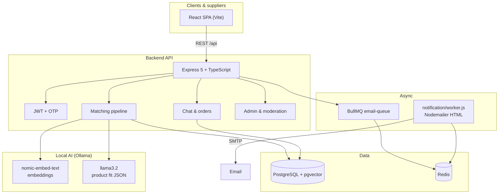

# Wisdom Match

**AI-powered client–supplier matchmaking platform** for B2B procurement: clients post requirements (RFQs), suppliers publish offerings, and a hybrid **embedding + LLM + business-rules** engine ranks matches, explains scores, and notifies both sides.

Built for the **Wisdom Group AI Intern** evaluation — functional product, not a keyword search demo.

---

## Table of contents

1. [What this platform does](#what-this-platform-does)
2. [Rubric coverage](#rubric-coverage)
3. [Architecture](#architecture)
4. [AI matching approach](#ai-matching-approach)
5. [Technology stack](#technology-stack)
6. [Repository layout](#repository-layout)
7. [Prerequisites](#prerequisites)
8. [Setup instructions](#setup-instructions)
9. [Running the application](#running-the-application)
10. [5-minute evaluator demo script](#5-minute-evaluator-demo-script)
11. [Extended demo (15 min)](#extended-demo-15-min)
12. [Environment variables](#environment-variables)
13. [Notifications & background jobs](#notifications--background-jobs)
14. [API overview](#api-overview)
15. [Scalability & extension points](#scalability--extension-points)
16. [Tests](#tests)
17. [Further reading](#further-reading)

---

## What this platform does

| Actor        | Capabilities                                                                                                                                                         |
| ------------ | -------------------------------------------------------------------------------------------------------------------------------------------------------------------- |
| **Client**   | Register profile, post/edit requirements, run AI matching, view ranked suppliers with scores and explanations, browse marketplace, chat with suppliers, place orders |
| **Supplier** | Register profile, publish/edit offerings (with photos), view AI match feed, respond to orders, chat with clients                                                     |
| **Admin**    | Platform overview, users/clients/suppliers/catalog, matches & orders, **chat moderation** (reports, warnings, suspend/activate accounts)                             |

**Auth:** Email OTP (JWT). Profiles are linked after first login.

**UI:** React SPA, landing page, role-based dashboards, dark mode toggle, responsive product chrome.

---

## Rubric coverage

| Requirement                    | Implementation                                                                                                                        |
| ------------------------------ | ------------------------------------------------------------------------------------------------------------------------------------- |
| Client portal form             | Company name (profile), product, category, quantity, budget, delivery location, timeline, notes (+ specs on edit) — `ClientDashboard` |
| Supplier portal form           | Supplier name (profile), product, category, quantity, pricing, location, delivery window, notes, photos — `SupplierDashboard`         |
| AI matching (not keyword-only) | pgvector semantic retrieval + LLM product fit + quantity/budget/delivery scoring → composite % stored in `matches`                    |
| Notifications                  | Email queue on match run, orders, chat, catalog changes (BullMQ + worker)                                                             |
| Dashboard                      | Client/supplier hubs + match detail drawer with status/score; admin console                                                           |

---

## Architecture

For a more detailed architecture diagram, view the [Architecture Diagram](./architecture.png).

High-level view of how requests, data, AI, and async email flow together.



### Request path (example: Run AI matching)

1. Client triggers `POST /api/requirements/:id/match` (authenticated).
2. **Retrieval:** Top offerings by cosine distance on requirement/offering embeddings (`<=>` in SQL).
3. **Per candidate:** Quantity coverage, budget rules, delivery vs required-by date, product signal + optional **LLM** classification.
4. **Composite score** (0–100%) written to `matches` with explanations and workflow status.
5. **Notification:** BullMQ jobs email client and relevant suppliers (threshold / top-N logic).

### Layer responsibilities

| Layer                  | Responsibility                                               |
| ---------------------- | ------------------------------------------------------------ |
| `frontend/`            | UX, dashboards, match visualization, marketplace, chat UI    |
| `backend/src/routes`   | HTTP surface, auth guards, validation                        |
| `backend/src/services` | Domain logic, matching, notifications, moderation            |
| `backend/src/db`       | SQL schemas; `pg` connection pool                            |
| `notification/`        | Email worker (decoupled from API process)                    |
| Ollama                 | Embeddings at create/update; LLM for ambiguous product pairs |

---

## AI matching approach

Matching is **multi-stage**. It is deliberately **not** a single keyword or full-text search.

### Stage 1 — Semantic retrieval (embeddings)

- On requirement/offering **create or update** (when product text changes), text is built from product + category (`matching-text.service.ts`) and embedded via Ollama **`nomic-embed-text`** (768-d vectors).
- Vectors are stored in PostgreSQL with **pgvector**.
- When matching runs, the engine loads the requirement embedding and selects the **top-K offerings** by vector distance (`matching.service.ts`).

This finds _semantically nearby_ catalog items before expensive LLM calls.

### Stage 2 — Fast product gate (rules + signals)

- `product-signal.service.ts` and `product-decision.service.ts` can short-circuit:
  - **CLEAR_REJECT** → 0% (e.g. wildly incompatible semantic/signal).
  - **CLEAR_MATCH** → skip LLM when confidence is high.
- Otherwise → Stage 3.

### Stage 3 — LLM product compatibility (Ollama `llama3.2`)

- `ai-evaluator.service.ts` asks the model for structured JSON: `EXACT_MATCH`, `CLOSE_MATCH`, `RELATED_BUT_DIFFERENT`, or `INCOMPATIBLE`, plus a short **reason** (shown in the UI).
- Prompt explicitly ignores price, quantity, and delivery so those are scored separately (cleaner explanations).

### Stage 4 — Business constraints

| Signal   | Service                        | Output                                               |
| -------- | ------------------------------ | ---------------------------------------------------- |
| Quantity | `quantity-matching.service.ts` | Coverage ratio (partial fulfillment supported)       |
| Budget   | `budget-matching.service.ts`   | `WITHIN_BUDGET` / `OVER_BUDGET` / `QUOTE_REQUIRED`   |
| Delivery | `delivery-matching.service.ts` | `ON_TIME` / `LATE` / `UNCERTAIN` vs required-by date |

### Stage 5 — Composite score

Weighted blend in `match-score.service.ts`:

- **40%** semantic similarity
- **20%** quantity coverage
- **20%** budget fit
- **20%** delivery fit

Hard rejects (`INCOMPATIBLE`, `CLEAR_REJECT`) → **0%**.

Results are **persisted** in `matches` (score, percentage, statuses, AI explanations, workflow status) and surfaced in **MatchCard** / **MatchDetailDrawer**.

### Why this design

- **Embeddings** scale catalog search and avoid brittle keywords.
- **LLM** handles nuanced product language (e.g. “1121 Basmati” vs “premium long-grain rice”).
- **Deterministic rules** keep pricing and logistics auditable for procurement users.
- **Stored explanations** support trust and demo storytelling.

---

## Technology stack

| Area          | Choices                                                            |
| ------------- | ------------------------------------------------------------------ |
| Frontend      | React 19, Vite 8, React Router 7, Framer Motion, CSS design system |
| Backend       | Node.js, Express 5, TypeScript, `pg`, Multer (offering photos)     |
| Database      | PostgreSQL + **pgvector** (768-d embeddings)                       |
| Cache / queue | Redis, BullMQ                                                      |
| AI (local)    | [Ollama](https://ollama.com) — `nomic-embed-text`, `llama3.2`      |
| Email         | Nodemailer + HTML templates (`notification/wisdom-email-html.js`)  |
| Auth          | OTP in Redis, JWT (`Bearer`)                                       |

---

## Repository layout

```
ai-matchmaking-platform/
├── README.md                 ← You are here
├── docs/
│   └── TUTORIAL_DEMO.md      ← 15-minute scripted demo + match matrix
├── backend/
│   ├── src/
│   │   ├── app.ts            Express app & route mounting
│   │   ├── server.ts         HTTP server + DB health check
│   │   ├── routes/           REST routers
│   │   ├── controllers/      Request handlers
│   │   ├── services/         Matching, chat, orders, admin, moderation
│   │   ├── middleware/       Auth, validation, uploads
│   │   └── db/               SQL schemas + pool
│   ├── scripts/
│   │   └── seed-demo-data.ts Demo dataset (@wisdommatch.demo)
│   └── uploads/              Offering images (served at /uploads)
├── frontend/
│   └── src/
│       ├── pages/            Dashboards, login, landing, admin
│       ├── components/       Match UI, chat, marketplace
│       └── api/client.js     API client
└── notification/
    └── worker.js             BullMQ email consumer
```

---

## Prerequisites

Install before setup:

| Tool                                      | Purpose                                                    |
| ----------------------------------------- | ---------------------------------------------------------- |
| **Node.js** 20+                           | Backend & frontend                                         |
| **PostgreSQL** 15+                        | Primary datastore                                          |
| **pgvector** extension                    | `CREATE EXTENSION vector;` in your DB                      |
| **Redis**                                 | OTP storage + BullMQ                                       |
| **Ollama** (optional for _live_ matching) | Embeddings + LLM; demo seed works without re-running match |
| **SMTP** (optional)                       | Real emails; OTP can be read from Redis for local demo     |

Pull Ollama models once:

```bash
ollama pull nomic-embed-text
ollama pull llama3.2
```

---

## Setup instructions

### 1. Clone and install dependencies

```bash
git clone https://github.com/YoinkGecko/ai-matchmaking-platform.git
cd ai-matchmaking-platform

cd backend && npm install && cd ..
cd frontend && npm install && cd ..
cd notification && npm install && cd ..
```

### 2. Create database

```bash
createdb ai_matchmaking
psql ai_matchmaking -c "CREATE EXTENSION IF NOT EXISTS vector;"
psql ai_matchmaking -c "CREATE EXTENSION IF NOT EXISTS pgcrypto;"
```

### 3. Apply SQL schemas (order matters)

Run from the repo root:

```bash
export DB=ai_matchmaking   # or your DB name

psql $DB -f backend/src/db/users.sql
psql $DB -f backend/src/db/schema.sql
psql $DB -f backend/src/db/supplierScehma.sql
psql $DB -f backend/src/db/matches_schema.sql
psql $DB -f backend/src/db/orders_schema.sql
psql $DB -f backend/src/db/chat_schema.sql
psql $DB -f backend/src/db/offering-photos.sql
psql $DB -f backend/src/db/admin-role.sql
psql $DB -f backend/src/db/moderation_schema.sql
```

### 4. Configure backend

```bash
cp backend/.env.example backend/.env
```

Edit `backend/.env`: database credentials, `JWT_SECRET`, and `ADMIN_EMAILS` (see [Environment variables](#environment-variables)).

### 5. Load demo data (recommended for evaluators)

```bash
cd backend
npm run seed:demo
```

Add the printed admin email to `ADMIN_EMAILS` in `.env`, then restart the API.

### 6. Configure notification worker (optional but recommended)

In `notification/`, ensure `.env` has `EMAIL_PASS` / SMTP settings consistent with your worker (`notification/worker.js`). The API only **enqueues** jobs; the worker **sends** mail.

---

## Running the application

Use **four terminals** for a full experience (API, UI, worker, Ollama).

| Terminal         | Command                             | URL / notes                                   |
| ---------------- | ----------------------------------- | --------------------------------------------- |
| 1 — API          | `cd backend && npm run dev`         | http://localhost:5001 — `/health`             |
| 2 — UI           | `cd frontend && npm run dev`        | http://localhost:5173 (proxies `/api` → 5001) |
| 3 — Email worker | `cd notification && node worker.js` | Consumes `email-queue`                        |
| 4 — Ollama       | `ollama serve`                      | http://localhost:11434                        |

**Production-style build:**

```bash
cd backend && npm run build && npm start
cd frontend && npm run build && npm run preview
```

---

## Environment variables

### `backend/.env`

| Variable                                                  | Description                                           |
| --------------------------------------------------------- | ----------------------------------------------------- |
| `PORT`                                                    | API port (default `5001`)                             |
| `JWT_SECRET`                                              | Sign JWTs after OTP verify                            |
| `DB_HOST`, `DB_PORT`, `DB_NAME`, `DB_USER`, `DB_PASSWORD` | PostgreSQL                                            |
| `ADMIN_EMAILS`                                            | Comma-separated emails allowed to log in as **ADMIN** |

### `frontend/.env`

| Variable       | Description                                    |
| -------------- | ---------------------------------------------- |
| `VITE_API_URL` | Optional; leave empty in dev to use Vite proxy |

### Notification worker

Configure SMTP in `notification/` (see worker and `EMAIL_PASS`). Redis defaults: `127.0.0.1:6379`.

---

## Notifications & background jobs

| Event                 | Queue job                          | Recipients                 |
| --------------------- | ---------------------------------- | -------------------------- |
| OTP login             | `send-otp`                         | User                       |
| Match run             | `send-match-notification`          | Client + matched suppliers |
| Chat message          | `send-chat-notification`           | Counterparty               |
| Order placed / status | order notification jobs            | Client + supplier          |
| RFQ/offering edit     | `send-catalog-change-notification` | Matched / chatting parties |
| Admin warning         | `send-moderation-warning`          | Warned user                |

The API process stays fast by **enqueue-only**; run `notification/worker.js` alongside the API.

---

## API overview

Base URL: `http://localhost:5001/api` (or proxied via Vite).

| Area        | Examples                                                               |
| ----------- | ---------------------------------------------------------------------- |
| Auth        | `POST /auth/request-otp`, `POST /auth/verify-otp`, `GET /auth/me`      |
| Client      | `POST /clients`, `GET/PATCH /clients/me/profile`, requirements CRUD    |
| Supplier    | `POST /suppliers`, offerings CRUD, `PATCH /suppliers/me/offerings/:id` |
| Matching    | `POST /requirements/:id/match`, `GET /requirements/:id/matches`        |
| Orders      | `POST .../orders`, supplier respond                                    |
| Chat        | `GET/POST /chats/...`, `POST /chats/messages/:id/report`               |
| Marketplace | `GET /marketplace/offerings` (client)                                  |
| Admin       | `/admin/overview`, users, reports, warnings, user status               |

Authenticated routes expect `Authorization: Bearer <jwt>`.

---

## Scalability & extension points

| Direction            | How the codebase supports it                                                                                            |
| -------------------- | ----------------------------------------------------------------------------------------------------------------------- |
| **More traffic**     | Stateless API behind a load balancer; connection pool already centralized                                               |
| **Heavier matching** | Move `runMatching` to a BullMQ worker; cache embeddings; tune top-K                                                     |
| **Better recall**    | HNSW index on pgvector; hybrid sparse+dense retrieval                                                                   |
| **Learning loop**    | `matches` table + future client feedback on cards → re-rank training data                                               |
| **Multi-tenant**     | Add `org_id` to clients/suppliers; scope queries in services                                                            |
| **Managed AI**       | Swap `embedding.service.ts` / `ai-evaluator.service.ts` URLs for OpenAI, Vertex, etc., keeping the same pipeline stages |

---

## Tests

Backend unit tests live under `backend/src/test/` (matching, budget, delivery, product decision, scores).

Run individually with `tsx` (example):

```bash
cd backend
npx tsx src/test/match-score.test.ts
```

---

## Further reading

- **[docs/TUTORIAL_DEMO.md](docs/TUTORIAL_DEMO.md)** — Full demo script and match matrix table
- **GitHub:** https://github.com/YoinkGecko/ai-matchmaking-platform

---

## Submission checklist (Wisdom Group)

- [ ] PostgreSQL + pgvector + Redis running
- [ ] `npm run seed:demo` and `ADMIN_EMAILS` set
- [ ] API + frontend + email worker started
- [ ] Walk through [5-minute evaluator demo script](#5-minute-evaluator-demo-script) once
- [ ] Repository link shared before **Thursday, 24 September 2026, 4:00 PM**

---

_Wisdom Match — thoughtful AI for B2B supplier discovery._
